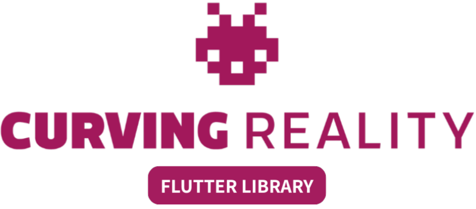

<div align="center" class="main-logo">
  
</div>
<hr>

<div class="flex-center">
    <a class="button-outline" href="#/services/README">⚙️&nbsp;&nbsp;Services</a>
    <a class="button-outline" href="#/widgets/README">🧩&nbsp;&nbsp;Widgets</a>
    <a class="button-outline" href="#/screens/README">📱&nbsp;&nbsp;Screens</a>
</div>

<br><br>

# What is this for?

The **Curving Reality Flutter Library** is designed to accelerate your app development workflow.<br>
It provides a rich collection of efficient and visually appealing **UI components**, **ready-to-use screens**, and practical **services**, including powerful tools for **forms validation**.<br>
<br>
Its core mission is to **reduce boilerplate code and simplify common development tasks**, allowing you to deliver **high-quality applications more quickly**.<br>
While focusing on productivity, the library also emphasizes **design consistency** and **user experience**, helping you create apps that are not only functional but also beautifully crafted.

# Example

Navigate this interactive example with all the components.<br>
Keep in mind that this is the representation of the Android UI. The style and the animations will be different when running on iOS.

---

<div class="flex-center">
    <div class="smartphone-container">
        <iframe src="https://www.curvingreality.com/projects/flutter-library/" style="height: 900px; border: solid 6px #111; border-radius: 36px; box-shadow: 0px 15px 15px #b0b0b0"></iframe>
    </div>
</div>
<br><br><br>

# How to use

---

## Install

Run these commands in your Flutter project to install the library and the dependencies.

```
flutter pub add curving_reality_library
flutter pub add animate_do
```

## Import

Import the global library file, or the single ones.

```dart
import 'package:curving_reality_library/curving_reality_library.dart'; // Global
import 'package:curving_reality_library/services/storage.dart'; // Specific service
import 'package:curving_reality_library/widgets/button.dart'; // Specific widget
...
```

## Dependencies

Some **components**, **screens** and **services** have external packages dependencies. This is the full list:

| Components / Screens / Services                                                           | Dependencies                                                                                                                                                                                |
| ----------------------------------------------------------------------------------------- | ------------------------------------------------------------------------------------------------------------------------------------------------------------------------------------------- |
| `CuReScaffold. All the screens`                                                           | [animate_do](https://pub.dev/packages/animate_do)                                                                                                                                           |
| `CuReUtils.openUrl, CuReLink, CuRePaywallScreen, CuReRegistrationScreen, CuReLoginScreen` | [url_launcher](https://pub.dev/packages/url_launcher)                                                                                                                                       |
| `CuReLoginScreen, CuReRegistrationScreen`                                                 | [font_awesome_flutter](https://pub.dev/packages/font_awesome_flutter)                                                                                                                       |
| `CuReAvatar`                                                                              | [cached_network_image](https://pub.dev/packages/cached_network_image)                                                                                                                       |
| `CuRePaywallScreen`                                                                       | [intl](https://pub.dev/packages/intl)                                                                                                                                                       |
| `CuReSupabaseService`                                                                     | [supabase_flutter](https://pub.dev/packages/supabase_flutter), [google_sign_in](https://pub.dev/packages/google_sign_in), [sign_in_with_apple](https://pub.dev/packages/sign_in_with_apple) |

<hr>

# Future Developments

We’re just getting started – here’s what’s coming next for **Curving Reality Flutter Library**:

**🛠 Refactoring**<br>
• Cleaner, faster, and more maintainable codebase.<br>
• Consistent patterns to make contributions and usage easier.

**🧩 New Widgets**<br>
• Fresh reusable UI widgets to cover more use cases.<br>
• Focus on flexibility, customization, and accessibility.

**📱 New Screens**<br>
• Ready-to-use screens and flows for common app scenarios.<br>
• Designed to save time and keep your apps beautiful out of the box.

**✨ Polished Details & Animations**<br>
• Smoother transitions and delightful micro-interactions.<br>
• Pixel-perfect refinements for an even more professional look.

**📝 Improve the Docs**<br>
• Clear docs = happy developers.<br>
• Fix typos, add and improve examples, or explain things in a simpler way.

⸻

🚀 Our mission is to keep evolving and making app development with Flutter faster, simpler, and more fun – while never compromising on design quality.

## What are we working on

- [ ] New button type
- [ ] Custom checkboxes
- [ ] Custom radio buttons
- [ ] Custom dialogs and bottom sheets
- [ ] "Insert code" type field
- [ ] Improved text fields UI

<hr>

# How to Contribute

We’d love your help to make **Curving Reality Flutter Library** grow and get even better! ❤️

Here’s how you can join the journey:

**🐞 Report Issues**<br>
• Spotted a bug? Open an issue and let us know.<br>
• The more details (steps, screenshots, expected vs. actual behavior), the better!

**💡 Suggest Features**<br>
• Have an idea that could improve the library?<br>
• Share it in the issues section – we’re always open to new ideas!

**⭐ Support the Project**<br>
• Give the repo a star ⭐ to spread the word.<br>
• Consider supporting the development by purchasing a commercial license if you use it in professional projects.<br>This helps us keep building new features and improving the library.

⸻

✨ No contribution is too small. Whether you report a bug, suggest a feature, or just support the project, you’re making a difference. <br>Thank you for being part of "../docs"**Curving Reality** 🚀

<hr>

# Who is Curving Reality?

[Curving Reality](https://www.curvingreality.com/) is an italian software house that develops mobile and web apps.
